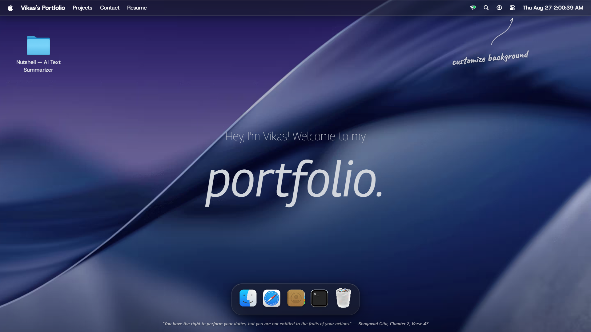

👦🏽 Vikas' Portfolio

An interactive macOS-inspired developer portfolio built to feel like a small desktop operating system rather than a conventional portfolio website.

Live: https://vikasaurous.github.io/portfolio/

Overview

This portfolio turns the usual portfolio experience into an interactive desktop: applications open inside draggable/resizable windows, the Dock launches apps, Finder exposes project information, and the Terminal provides a command-driven way to explore the site.

The project started from a macOS-inspired visual direction and was then extended and reworked around a custom window system, shared state, interaction logic, and portfolio-specific content.

Highlights

🖥️ macOS-style desktop — menu bar, desktop icons, Dock, wallpaper, and application windows.

🪟 Custom window manager — open, close, minimize, maximize, focus, drag, resize, and z-index stacking for multiple windows.

📁 Finder-style project explorer — projects and portfolio content are represented as files and folders instead of static cards.

⌨️ Interactive Terminal — command parser with commands such as help, ls, cat, whoami, history, clear, and portfolio-specific commands.

🔎 Spotlight-style search — quickly search across portfolio content and available applications.

🎨 Theme support — light, dark, and system-aware theme handling through Zustand.

🖼️ Background customization — viewers can personalize the desktop background without uploading the image to a server.

✨ GSAP interactions — window and Dock interactions use GSAP where animation timing and coordinated transitions benefit from it.

🧩 Reusable architecture — a shared window shell and centralized state allow different applications to plug into the same desktop environment.

📱 Responsive behavior — the experience is optimized primarily for desktop while handling smaller viewports gracefully.

Tech Stack

Technology

Purpose

React

UI and application architecture

Vite

Development server and production build

Tailwind CSS

Styling and responsive UI

Zustand

Global window and theme state

GSAP

Animation and interaction timing

Lucide React

Interface icons

React PDF

Resume rendering

Day.js

Date/time handling

Architecture

The application is organized around a small desktop/window system rather than independent page components.

src/
├── components/       # Desktop UI: Dock, Navbar, Spotlight, Home, etc.
├── constants/        # Portfolio data, apps, filesystem entries and configuration
├── hoc/              # Shared window behavior / wrappers
├── store/            # Zustand stores for windows, theme and location
├── windows/          # Finder, Terminal, Safari, Resume, Contact, Text, Image, Trash
├── App.jsx           # Application composition and global setup
└── index.css         # Global styles and Tailwind entry

The important architectural idea is that window behavior is shared. Individual applications provide content, while the window system handles lifecycle, focus, positioning, and stacking. This keeps new desktop applications from requiring a second window implementation.

Terminal

The Terminal is more than a visual mockup. It maintains command history and keyboard interactions and routes recognized commands through a dedicated command registry.

Example commands include:

help
whoami
skills
projects
experience
education
ls
cat <file>
history
clear

Keyboard support includes command history navigation, tab completion for commands, and common terminal shortcuts.

Background Customization

The Change Background feature lets visitors personalize the desktop with available wallpapers and their own image.

The custom wallpaper is handled client-side. It is intentionally temporary: refreshing or starting a new session returns the portfolio to its default background instead of permanently storing the visitor's image.

The implementation also accounts for practical browser constraints such as unsupported image formats, large uploads, invalid files, and keeping the desktop UI readable over high-contrast or light wallpapers.

Running Locally

Requirements

Node.js 18+

npm

Install

git clone https://github.com/vikasaurous/macos_portfolio.git
cd macos_portfolio
npm install

Start the development server

npm run dev

Then open the local Vite URL shown in the terminal, normally:

http://localhost:5173

Production build

npm run build

Preview the production build with:

npm run preview

Deployment

The portfolio is deployed to GitHub Pages using the gh-pages package.

npm run deploy

The production URL is:

https://vikasaurous.github.io/portfolio/

Engineering Focus

The interesting part of this project is not simply recreating the appearance of macOS. The goal is to make the interaction model behave consistently as the number of applications grows.

That means keeping responsibilities separated:

Zustand owns shared desktop state.

Window wrappers own reusable window behavior.

Application components own application-specific UI and local state.

Configuration/data modules own portfolio content.

GSAP is used where coordinated animation is useful rather than making every interaction animation-dependent.

This structure makes it possible to add or modify desktop applications without duplicating the underlying window logic.

Project

The main project currently showcased in the portfolio is Nutshell — AI Text Summarizer, a full-stack AI-powered text summarization application.

Project details and links are available inside the Finder-style Work directory of the portfolio.

Feedback

This is an ongoing project. If you notice an interaction that feels inconsistent, a responsive edge case, or an architectural improvement worth considering, feel free to open an issue or start a discussion.

Constructive feedback is welcome.

Author

Vikas Yadav

GitHub: https://github.com/vikasaurous

LinkedIn: https://www.linkedin.com/in/connectvikasyadav/

Portfolio: https://vikasaurous.github.io/portfolio/

  Built with React, curiosity, and a questionable amount of debugging. ☕

